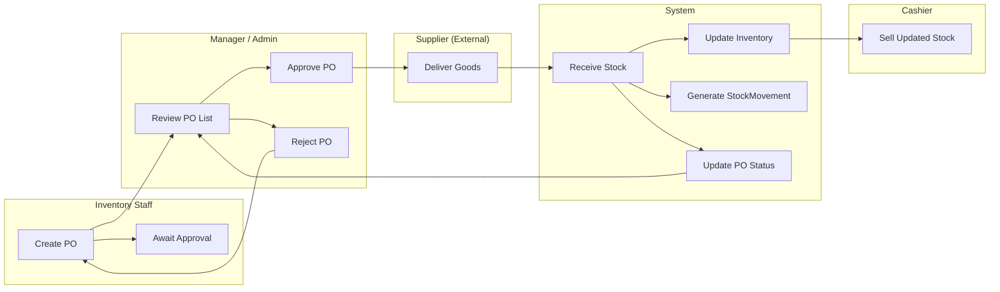
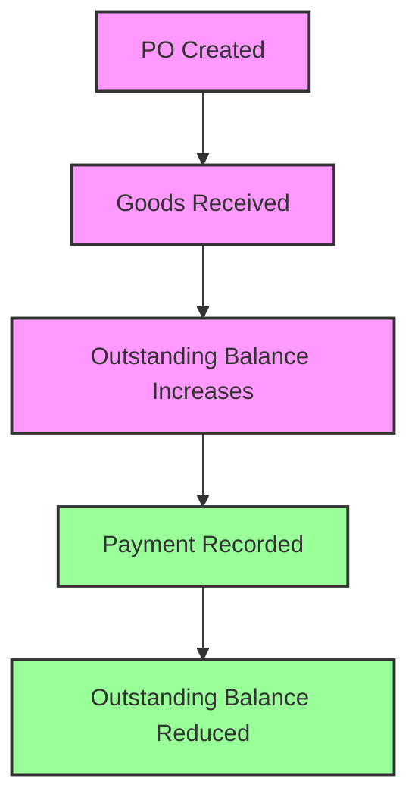
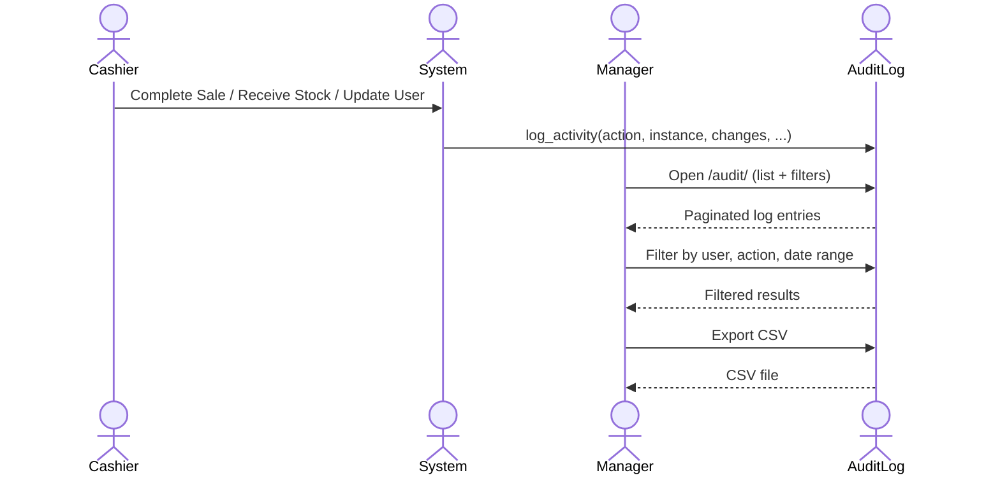

# System Workflows — Inventory, Sales & Supplier Management

> **Analysis date:** 2026-08-02  
> **Scope:** Read-only code review of the current Django codebase (commit `5c1037f`)  
> **Note:** Every section below is grounded in the actual views, URLconf, models, and templates found in the repository. Where a feature exists in the original specification but is not implemented in code, it is explicitly noted.

---

## A. Role Overview Table

| Role | Primary Purpose | Main Modules Accessible | Landing Page After Login |
|---|---|---|---|
| **Admin** | System owner / superuser; full configuration, user governance, and audit oversight | All modules (Categories, Products, Suppliers, Purchases, POS, Customers, Reports, Audit Log, User Management) | Dashboard (`/`) |
| **Manager** | Operations overseer; purchasing, reporting, and user administration (limited) | Categories, Products, Suppliers, Purchases, POS, Customers, Reports, Audit Log | Dashboard (`/`) |
| **Cashier** | Point-of-sale operator; processes sales and manages customer records | POS, Customers, Sales History (own sales only), Sale Detail (own sales only) | Dashboard (`/`) |
| **Inventory Staff** | Stock and catalog custodian; manages products, suppliers, purchase orders, and receipts | Categories, Products, Suppliers, Purchases | Dashboard (`/`) |

### Permission summary (by module)

| Module / View | Admin | Manager | Cashier | Inventory Staff |
|---|---|---|---|---|
| Dashboard (HomeView) | ✅ | ✅ | ✅ | ✅ |
| Categories (CRUD) | ✅ | ✅ | ❌ | ✅ |
| Products (list/detail/create/update/delete) | ✅ | ✅ | ❌ | ✅ |
| Alerts (list/resolve) | ✅ | ✅ | ❌ | ✅ |
| POS | ✅ | ✅ | ✅ | ❌ |
| Receipt (view/print) | ✅ | ✅ | ✅ | ❌ |
| Suppliers (CRUD) | ✅ | ✅ | ❌ | ✅ |
| Supplier Payments (CRUD) | ✅ | ✅ | ❌ | ✅ |
| Purchases (list/detail/create/update/cancel/approve/reject/receive) | ✅ | ✅ | ❌ | ✅ |
| Sales — Cancel | ✅ | ✅ | ❌ | ❌ |
| Customers (CRUD) | ✅ | ✅ | ✅ | ❌ |
| Reports — Sales Report | ✅ | ✅ | ❌ | ❌ |
| Reports — Sales History | ✅ | ✅ | ✅* | ❌ |
| Reports — Sale Detail | ✅ | ✅ | ✅* | ❌ |
| Audit Log (list/detail/export) | ✅ | ✅ | ❌ | ❌ |
| User Management | ✅ | ✅ | ❌ | ❌ |
| Admin Register | ✅ | ❌ | ❌ | ❌ |
| Self Profile Edit | ✅ | ✅ | ✅ | ✅ |
| Self Password Change / Reset | ✅ | ✅ | ✅ | ✅ |

\* Cashier access is scoped: they see only their own sales rows (`cashier=request.user`).

---

## B. Per-Role Workflow

### 1. Admin

**1.1 First screen after login**  
Logs in at `/accounts/login/`. On successful authentication, redirected to `/` (Dashboard). The Dashboard shows:
- Total Products
- Total Sales Today (global)
- Low Stock Items
- Open Alerts
- Quick Actions: Manage Categories, Manage Products, Manage Suppliers, Manage Customers

**1.2 Navigation (sidebar)**
- Dashboard
- Categories
- Products
- Alerts
- Suppliers
- Purchases
- POS
- Customers
- Reports
- Sales History
- Audit Log
- User Management

**1.3 Day-in-the-life walkthrough**
1. Logs in → lands on Dashboard.
2. Checks Quick Actions or opens **Purchases** to review pending PO statuses.
3. Opens **User Management** to approve/reject new registrations or edit/deactivate users.
4. Creates a new user via **Admin Register** (immediately approved).
5. Reviews **Audit Log** for suspicious activity or exports CSV for compliance.
6. Accesses **Reports** → Sales Report for aggregate view.
7. Can perform any CRUD operation on Categories, Products, Suppliers, Purchase Orders.
8. Can operate the **POS** and create/void sales like a Manager or Cashier.

**1.4 Approval/handoff points**
- Approves or rejects self-registered accounts (only Admin can approve/reject per `UserManagementView` logic).
- Last-admin safeguard: the last active admin cannot be deactivated or deleted.
- Can approve or reject purchase orders (two-tier authorization).

**1.5 What Admin CANNOT do (by code)**
- There is no explicit restriction beyond what Django's model/session logic enforces; effectively Admin can do everything the codebase exposes.

---

### 2. Manager

**2.1 First screen after login**  
Same as Admin: Dashboard (`/`).

**2.2 Navigation (sidebar)**
- Dashboard
- Categories
- Products
- Alerts
- Suppliers
- Purchases
- POS
- Customers
- Reports
- Sales History
- Audit Log

**2.3 Day-in-the-life walkthrough**
1. Logs in → Dashboard.
2. Opens **Purchases** to create a PO (sets supplier, expected delivery, line items with quantity/cost).
3. Reviews PO detail; if goods arrive, opens **Receive** screen for that PO.
4. Can approve or reject pending POs (two-tier authorization).
5. Opens **Reports** → Sales Report for aggregate figures.
6. Checks **Sales History** (all cashiers' sales).
7. Views **Audit Log** for changes and exports if needed.
8. Manages **Customers** (create/edit).
9. Can edit/deactivate Cashier and Inventory Staff accounts via **User Management** (but cannot edit other Managers or Admins, nor delete accounts with history).

**2.4 Approval/handoff points**
- Cannot approve user accounts — only Admin can (`_is_admin` gate in `UserManagementView`).
- Cannot delete accounts with audit/sale/PO history (`_has_history` blocks delete).
- Cannot edit another Manager or Admin (`_can_edit` returns false for admin targets).
- Cannot access Admin Register.

**2.5 What Manager CANNOT do**
- Access **User Management** to delete accounts or approve/reject registrations (only Admin).
- Create other Admins via Admin Register (view is `allowed_roles = ['admin']`).
- Deactivate/delete the last remaining admin.

---

### 3. Cashier

**3.1 First screen after login**  
Dashboard (`/`). Dashboard now shows role-specific KPIs for cashiers:
- Total Products
- My Today's Sales Count (sales created by this cashier today)
- Low Stock Items
- Open Alerts
- Quick Actions: POS, Customers, Sales History

**3.2 Navigation (sidebar)**
- Dashboard
- POS
- Customers
- Sales History

**3.3 Day-in-the-life walkthrough**
1. Logs in → Dashboard.
2. Navigates to **POS** (`/products/pos/`).
3. Searches/filters active products; enters quantity and clicks **Add to Cart** (cart stored in session).
4. Repeats for additional items.
5. Clicks **Checkout**:
   - Enters optional discount.
   - Selects payment method (Cash/Card/GCash).
   - Enters amount tendered (defaults to total).
   - System creates `Sale` (status `pending`) + `SaleItem` rows + `Payment` row.
   - Calls `sale.complete_checkout()` which:
     - Validates stock availability for every line.
     - If stock insufficient, raises `ValueError` — POS view catches it and shows friendly error.
     - Deducts stock from `Product.quantity_in_stock`.
     - Triggers `product.create_alerts()` to update low-stock/expiring alerts.
     - Creates `StockMovement` entries (type `sale`).
     - Logs audit entries for stock adjustments and status change.
     - Updates sale status to `completed`.
   - Clears cart session.
   - Redirects to receipt page.
6. Views/prints receipt (`/products/sale/<pk>/receipt/`).
7. Later, opens **Sales History** to review own past sales (searchable by date, payment method, status).
8. Manages **Customers** — creates or updates customer records.

**3.4 Approval/handoff points**
- Insufficient stock at checkout shows a friendly error message and redirects back to POS.
- Can cancel a sale only if Manager/Admin (via `SaleCancelView`).
- Low-stock alerts are created by `Product.create_alerts()`, and can be viewed/resolved via Alert list page.

**3.5 What Cashier CANNOT do**
- Access Categories, Products (CRUD), Suppliers, Purchases, Reports (Sales Report), Audit Log, User Management.
- View other cashiers' sales — `SalesHistoryView` and `SaleDetailView` filter to `cashier=request.user`.
- Void or return a sale — requires Manager/Admin.

---

### 4. Inventory Staff

**4.1 First screen after login**  
Dashboard (`/`).

**4.2 Navigation (sidebar)**
- Dashboard
- Categories
- Products
- Alerts
- Suppliers
- Purchases

**4.3 Day-in-the-life walkthrough**
1. Logs in → Dashboard.
2. Opens **Products** to list/search/filter products by category, supplier, stock status.
3. Creates a new Product or updates an existing one.
4. Opens **Suppliers** to ensure supplier master data is current.
5. Opens **Purchases** → creates a PO with line items.
6. When supplier delivers, opens PO detail → clicks **Receive**.
7. Enters received quantities per line; submits.
8. `StockReceipt.save()` applies stock:
   - Updates `Product.quantity_in_stock`.
   - Triggers `product.create_alerts()` for low-stock/expiring alerts.
   - Creates `StockMovement` entries (type `purchase`).
   - Updates PO status to `partial` or `received` depending on cumulative receipts.
   - Logs audit entry for stock adjustment and status change.
9. Reviews Dashboard widget "Low Stock Items" to prioritize reordering.
10. Can resolve alerts via Alert list page.

**4.4 Approval/handoff points**
- POs created by Inventory Staff require Manager/Admin approval before they are considered fully authorized (approve/reject views available to Manager/Admin).
- Cannot access POS or Customers modules.

**4.5 What Inventory Staff CANNOT do**
- Access POS, Customers, Reports, Audit Log, User Management.
- Approve/reject user accounts.
- Delete or edit other roles beyond what Manager/Admin allow (same `_can_edit` logic applies).

---

## C. Cross-Role Process Flows

### C.1 Procure-to-Stock Flow

**Actors:** Inventory Staff (primary), Manager/Admin (approval), Supplier (external)

**Step-by-step (actual code path):**
1. Inventory Staff navigates to **Purchases** → **Create PO** (`/purchases/create/`).
   - Selects Supplier, Expected Delivery Date.
   - Adds line items (Product, Quantity Ordered, Unit Cost).
   - Submits → `PurchaseOrder` saved with status `pending`.
2. PO is now visible to Admin, Manager, and Inventory Staff in the PO list/detail.
3. Manager/Admin reviews the PO and either:
   - **Approves** (`/purchases/<pk>/approve/`) — logs approval, PO remains `pending` (ready for supplier).
   - **Rejects** (`/purchases/<pk>/reject/`) — PO status transitions to `cancelled`, inventory staff is notified.
4. Supplier delivers goods.
5. Inventory Staff opens PO detail → clicks **Receive** (`/purchases/<pk>/receive/`).
6. Enters received quantity for each line; submits.
7. `StockReceipt.save()`:
   - For each line, increments `Product.quantity_in_stock` by received qty.
   - Triggers `product.create_alerts()`.
   - Creates `StockMovement` (type `purchase`) per product.
   - Recalculates PO totals across all receipts:
     - If fully received → PO status → `received`.
     - If partially received → PO status → `partial`.
     - Otherwise stays `pending`.
   - Logs audit entry for stock adjustment and status change.
8. Dashboard "Low Stock Items" count decreases automatically as product stock levels update.
9. Cashier can now sell the newly received stock from POS.

---

### C.2 Sale Flow

**Actors:** Cashier (primary), Customer (external), Manager/Admin (oversight)

**Step-by-step (actual code path):**
1. Cashier opens **POS** (`/products/pos/`).
2. Searches/scans product list (active products only).
3. Adds items to cart (session-backed).
4. Proceeds to Checkout:
   - Enters discount (optional).
   - Selects payment method.
   - Enters amount tendered.
5. System creates `Sale` (status `pending`) + `SaleItem` rows + `Payment` row.
6. `sale.complete_checkout()`:
   - Validates stock for every line (raises if insufficient).
   - Deducts stock from each product.
   - Triggers `product.create_alerts()`.
   - Creates `StockMovement` (type `sale`) per product.
   - Sets `Sale.status = 'completed'`.
   - Logs audit entries for stock deductions and sale completion.
7. Cart cleared; Cashier redirected to Receipt view (`/products/receipt/<pk>/`).
8. Receipt can be printed (`/products/sale/<pk>/receipt/`).
9. Sale is recorded and visible in:
   - **Sales History** (Cashier sees only own sales; Manager/Admin see all).
   - **Sales Report** (Admin/Manager only).
   - **Audit Log** (Admin/Manager).

**Return/Void flow:**  
Manager or Admin can cancel a completed sale via `/products/sale/<pk>/cancel/` (`SaleCancelView`):
- Validates sale is `completed`.
- Restores stock quantities.
- Creates `StockMovement` entries (type `return`).
- Updates `Product.create_alerts()`.
- Sets `Sale.status = 'cancelled'`.
- Logs audit entries for stock restoration and status change.

---

### C.3 Supplier Payment Flow

**Actors:** Inventory Staff/Manager/Admin (primary), Supplier (external)

**Actual code state:**
- The `Supplier` model has an `outstanding_balance` field.
- The `SupplierPayment` model exists with fields: supplier, purchase_order (FK, optional), amount, date, method, status (`pending`/`partial`/`paid`).
- **CRUD views, forms, and URLs are implemented** for managing supplier payments:
  - List: `/suppliers/payments/`
  - Create: `/suppliers/payments/create/`
  - Update: `/suppliers/payments/<pk>/update/`
  - Delete: `/suppliers/payments/<pk>/delete/`
- `outstanding_balance` is recalculated from the sum of paid `SupplierPayment` amounts on each create/update.
- **Result:** Supplier payment is fully operational; `outstanding_balance` reflects the total paid amount.

---

### C.4 Low-Stock / Expiration Alert Flow

**Actors:** System (auto-generated), Inventory Staff/Manager/Admin (viewers)

**Actual code state:**
- `Product.create_alerts()` creates `Alert` records for:
  - `low_stock`: when `quantity_in_stock <= reorder_level`.
  - `expiring`: when `expiration_date` is within 7 days.
- Alerts are displayed as a count on the Dashboard (`Alert.objects.filter(is_resolved=False).count()`).
- **Alert list/detail/resolve views and URLs are implemented**:
  - List: `/products/alerts/` (filterable by type and resolved status)
  - Resolve: `/products/alerts/<pk>/resolve/`
- `create_alerts()` is called automatically:
  - After `Sale.complete_checkout()`
  - After `StockReceipt.receive()`
  - After `SaleCancelView` restores stock
- **Result:** Alerts are generated, counted, listed, and resolvable. Alert data stays current after stock movements.

---

### C.5 Audit Trail Flow

**Actors:** Admin, Manager (viewers); all roles (implicit subjects)

**Step-by-step (actual code path):**
1. Throughout the system, `audit.services.log_activity(...)` is called in:
   - User approval/rejection/update/deactivation (`accounts/views.py`).
   - PO approval/rejection/cancellation (`purchase/views.py`).
   - Stock receipt adjustments (`product/models.py` — `StockReceipt.receive()`).
   - Sale checkout and stock deductions (`product/models.py` — `Sale.complete_checkout()`).
   - Sale cancellation (`product/views.py` — `SaleCancelView`).
   - Supplier payment recording (`supplier/views.py`).
2. `AuditLog` entries capture:
   - User (actor), action, severity, content type, object ID, object repr, description, changes (old/new), IP address, user agent.
3. Admin/Manager can:
   - View **Audit Log** list (`/audit/`) — filterable by user, action, severity, content type, date range, and search.
   - View individual log entry detail (`/audit/<pk>/`).
   - Export filtered logs to CSV (`/audit/export/`).
4. Example dispute trace:
   - Manager suspects a sale total is wrong → opens **Audit Log** → filters by action `STOCK_ADJUSTMENT` or `STATUS_CHANGE` → finds the `Sale` entry → inspects `changes` dict showing old/new stock levels and status transitions.

---

## D. Visual Flow Diagrams

### D.1 Procure-to-Stock Flow



### D.2 Sale Flow

```mermaid
flowchart LR
    subgraph "Cashier"
        A[Open POS]
        B[Add to Cart]
        C[Checkout]
    end
    subgraph "System"
        D[Create Sale + SaleItems + Payment]
        E[Validate Stock]
        F[Deduct Stock]
        G[Create StockMovement (sale)]
        H[Set Sale = completed]
        I[Clear Cart]
    end
    subgraph "Manager / Admin"
        J[View Sales History / Reports]
        K[Cancel Sale]
    end

    A --> B
    B --> C
    C --> D
    D --> E
    E --> F
    F --> G
    G --> H
    H --> I
    I --> J
    J --> K
```

### D.3 Supplier Payment Flow



> **Note:** The payment flow is now fully implemented with CRUD views and automatic balance recalculation.

### D.4 Low-Stock / Expiration Alert Flow

```mermaid
flowchart TD
    A[Stock Updated / Product Saved] --> B{create_alerts() triggered?}
    B -->|No| C[No change]
    B -->|Yes| D{Stock <= reorder_level?}
    D -->|Yes| E[Create low_stock Alert]
    B -->|Yes| F{Expiring within 7 days?}
    F -->|Yes| G[Create expiring Alert]
    E --> H[Alerts counted on Dashboard]
    G --> H
    H --> I{Alert list view exists?}
    I -->|Yes| K[Staff resolves alert]
    I -->|No| J[Staff cannot resolve alerts]

    style J fill:#f96,stroke:#333,stroke-width:2px
    style K fill:#9f9,stroke:#333,stroke-width:2px
```

> **Note:** `create_alerts()` is now called automatically after stock movements (sale, receipt, return). Alert list and resolve views are implemented.

### D.5 Audit Trail Flow



---

## E. Gaps or Inconsistencies Found While Tracing the Code

### E.1 Missing Approval Gate for Purchase Orders
- **Status:** ✅ Fixed
- **Observation:** Any user with `admin`, `manager`, or `inventory_staff` role could create, update, and receive a PO. There was no "Manager approval before sending to supplier" step.
- **Fix:** Added `PurchaseOrderApproveView` and `PurchaseOrderRejectView` in `purchase/views.py`. Only `admin` and `manager` can approve/reject POs. URLs: `/purchases/<pk>/approve/` and `/purchases/<pk>/reject/`. Approval/rejection actions are logged via `AuditLog`.

### E.2 No Void / Return / Cancel Flow for Sales
- **Status:** ✅ Fixed
- **Observation:** `Sale.STATUS_CANCELLED` exists in the model, but no view transitions a sale to `cancelled`. The POS checkout path always sets `status = 'completed'` via `complete_checkout()`.
- **Fix:** Added `SaleCancelView` in `product/views.py` (admin/manager only). Validates preconditions, reverses stock, logs audit entries, and updates sale status. URL: `/products/sale/<pk>/cancel/`.

### E.3 Alerts Are Generated but Not Surfaced for Action
- **Status:** ✅ Fixed
- **Observation:** `Product.create_alerts()` generates `Alert` rows, and the Dashboard shows a count. However, there was no URL or view to list, filter, or resolve alerts.
- **Fix:** Added `AlertListView` and `AlertResolveView` in `product/views.py`. URLs: `/products/alerts/` and `/products/alerts/<pk>/resolve/`.

### E.4 `create_alerts()` Is Not Triggered Automatically
- **Status:** ✅ Fixed
- **Observation:** The method existed but was only called in tests. After stock receipt, sale, or manual stock edit, alerts were not recalculated.
- **Fix:** `product.create_alerts()` is now called in:
  - `StockReceipt.receive()` in `product/models.py`
  - `Sale.complete_checkout()` in `product/models.py`
  - `SaleCancelView.post()` in `product/views.py`
  - `StockReceiptView.post()` in `purchase/views.py`

### E.5 Supplier Payment Module Is Unfinished
- **Status:** ✅ Fixed
- **Observation:** `Supplier` has `outstanding_balance`; `SupplierPayment` model exists. But there were **no views, forms, or URLs** for managing supplier payments.
- **Fix:** Implemented full CRUD views for `SupplierPayment` in `supplier/views.py`:
  - `SupplierPaymentListView`, `CreateView`, `UpdateView`, `DeleteView`
- `outstanding_balance` is recalculated from paid payments on create/update.
- URLs registered under `supplier/payments/`.

### E.6 Dashboard Not Role-Differentiated
- **Status:** ✅ Fixed
- **Observation:** All roles landed on the same `HomeView` and saw the same KPI cards and Quick Actions. Cashiers saw product/supplier/purchase management buttons that they cannot use.
- **Fix:** `HomeView` now shows `my_today_sales_count` for cashiers (their own sales only) via `Sale.objects.filter(date__date=today, cashier=user)`.

### E.7 Overselling Results in Unhandled Exception
- **Status:** ✅ Fixed
- **Observation:** In `POSView.post()`, if `sale.complete_checkout()` raises `ValueError('Insufficient stock ...')`, the view did not catch it. Django returned a 500 error.
- **Fix:** Wrapped `complete_checkout()` in a `try/except ValueError`, shows `messages.error(...)`, and redirects back to `product:pos`.

### E.8 Manager Can Edit Inventory Staff / Cashier but Not Other Managers
- **Status:** ✅ Documented
- **Observation:** `_can_edit()` in `UserManagementView` allows Admin to edit anyone; Manager can only edit Cashier and Inventory Staff. This is intentional, but no comment or docstring explained the rationale.
- **Fix:** Added docstring to `UserManagementView` and `_can_edit()` method explaining the edit policy.

### E.9 Audit Log Viewer Uses `models_Q_object` (Typo / Non-Standard)
- **Status:** ✅ Fixed
- **Observation:** `AuditLogListView.get_queryset()` called `models_Q_object(search)` — the function is defined locally, but the name suggests a Django `models.Q` import confusion.
- **Fix:** Renamed function to `build_search_q` in `audit/views.py` and updated all references.

### E.10 No Dedicated "My Profile" or Account Settings View
- **Status:** ✅ Fixed
- **Observation:** Users can change password, but there was no view to edit their own profile (name, email, etc.) from the UI.
- **Fix:** Added `ProfileView` (UpdateView) in `accounts/views.py`. URL: `/accounts/profile/`. Allows users to edit their own first name, last name, and email.

---

*End of document.*